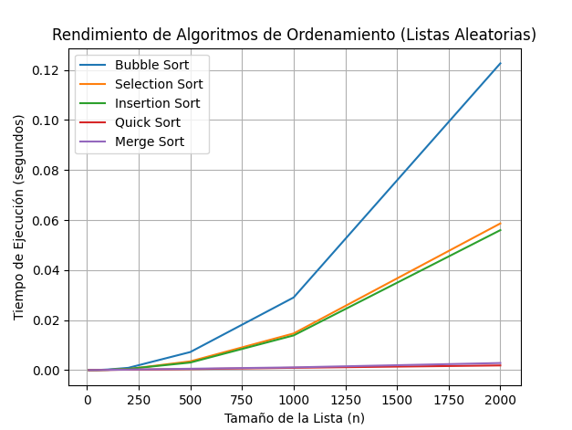

# 📚 Análisis de Algoritmos de Búsqueda y Ordenamiento en Python

Este proyecto implementa y compara distintos algoritmos clásicos de **búsqueda** y **ordenamiento**. Incluye pruebas interactivas, visualización de rendimiento y una estructura limpia.

---

## 🚀 Características Principales

- **Algoritmos de Búsqueda:**
  - Búsqueda Lineal
  - Búsqueda Binaria

- **Algoritmos de Ordenamiento:**
  - Burbuja (Bubble Sort)
  - Selección (Selection Sort)
  - Inserción (Insertion Sort)
  - Quicksort
  - Mergesort

- **Visualización de Rendimiento:**
  - Gráficos comparativos de tiempos de ejecución para cada algoritmo.

- **Pruebas Interactivas:**
  - Menú por consola para probar y comparar algoritmos con cualquier lista de números.

---

## 📁 Estructura del Proyecto

```
algoritmos-busqueda-ordenamiento/
│
├── main.py
├── requirements.txt
├── readme.md
├── docs/
│   ├── marco_teorico.md
│   ├── referencias.md
│   └── resultados_pruebas.md
├── src/
│   ├── utils/
│   │   ├── generador_datos.py
│   │   └── medidor_tiempo.py
│   ├── ordenamiento/
│   │   ├── burbuja.py
│   │   ├── seleccion.py
│   │   ├── insercion.py
│   │   ├── quicksort.py
│   │   └── mergesort.py
│   │ 
│   └── busqueda/
│       ├── lineal.py
│       └── binaria.py
│       
└── tests/ (opcional, solo si se usan pruebas automáticas)
    ├── test_busqueda.py
    └── test_ordenamiento.py
```

---

## 📦 Dependencias del Proyecto

### Librerías de Terceros
- **matplotlib** (>=3.7.1): Utilizada para la generación de gráficos de rendimiento
- **numpy** (>=1.24.3): Utilizada para operaciones numéricas y manejo de arrays
- **pytest** (>=7.3.1): Framework para pruebas unitarias

### Librerías Estándar de Python
- **copy**: Para la copia de objetos
- **random**: Para la generación de números aleatorios
- **sys**: Para operaciones del sistema
  
### Instalar dependencias con:
  ```bash
  pip install -r requirements.txt
  ```

---

## 🖥️ ¿Cómo usar el menú interactivo?

1. Ejecuta el programa principal:
   
   ```bash
   python main.py
   ```
2. Elige una opción del menú:
   - Probar algoritmos de ordenamiento
   - Probar algoritmos de búsqueda
   - Ejecutar experimentos de rendimiento (y ver gráficos)
   - Salir

---

## 📊 Ejemplo de uso

### Menú principal

```
--- MENÚ PRINCIPAL ---
1. Probar algoritmos de ordenamiento
2. Probar algoritmos de búsqueda
3. Ejecutar experimentos de rendimiento (ordenamiento)
4. Ejecutar experimentos de rendimiento (búsqueda)
5. Salir
Seleccione una opción:
```

### Prueba de ordenamiento

```
Lista original: [5, 3, 8, 1]
Lista ordenada: [1, 3, 5, 8]
Tiempo de ordenamiento: 0.000012 segundos
Posición de 8 en la lista original: 2 (Tiempo: 0.000001 s)
Posición de 8 en la lista ordenada: 3 (Tiempo: 0.000001 s)
```

### Prueba de búsqueda

```
Lista original: [5, 3, 8, 1]
Lista ordenada: [1, 3, 5, 8]
Resultado de búsqueda binaria en lista ordenada: 1 (Tiempo: 0.000001 s)
Resultado de búsqueda binaria en lista original: No encontrado (Tiempo: 0.000001 s)
```

---

## 📈 Ejemplo de gráfico



---

## 📝 Resultados de Pruebas

- Todos los algoritmos funcionan correctamente en casos normales y casos límite (listas vacías, un solo elemento, elemento no encontrado).
- Los gráficos muestran claramente la diferencia de eficiencia entre algoritmos O(n²) y O(n log n).
- El menú interactivo permite comparar fácilmente el funcionamiento y rendimiento de cada algoritmo.

---

## 📚 Créditos

Trabajo realizado para la materia **Programación I** - UTN  
Autores: **Renzo Calcatelli** y **Hugo Albertini**

---

## 🤖 Herramientas y Asistencia en el Desarrollo
Este proyecto ha sido desarrollado con la asistencia de herramientas de Inteligencia Artificial (IA) para:
- Estructuración inicial del proyecto
- Asistencia en la redacción de documentación
- Sugerencias de implementación y optimización de código

Es importante destacar que:
- Todo el código ha sido revisado, validado y comprendido por el desarrollador
- Las decisiones finales sobre implementación y estructura fueron tomadas por el desarrollador
- La IA fue utilizada como herramienta de apoyo, no como reemplazo del trabajo intelectual


